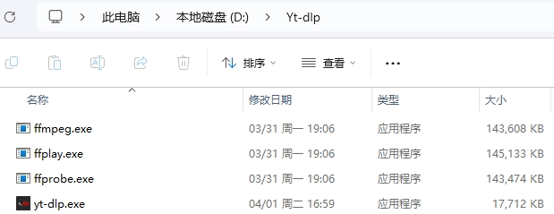

## YT-DLP下载各大网站视频
1.资源下载

* `YT-DLP`  - ^^[Github库](https://github.com/yt-dlp/yt-dlp?tab=readme-ov-file)^^.
* `FFmpeg`  - ^^[官网地址](https://ffmpeg.org/)^^.

使用方法

2.配置、启动

* `1` ffmpeg-git-ful.7z后将bin 文件夹中的ffmpeg.exe、ffplay.exe、ffprobe.exe 三个文件拷贝到yt-dlp.exe所在目录，即t-dlp.exe、ffmpeg.exe、ffplay.exe、ffprobe.exe 四个文件放置到同一文件夹下
* `2` 在此文件夹中，空白处，右键，点击在终端中打开，以启动WindowsPowerShell
* `3` 注意:yt-dlp.exe 不能直接双击运行使用，需要采用终端打开，才能使用



3.常用命令

* `1` 下载视频
``` py
.\yt-dlp <URL链接>
```

* `2` 下载音频
``` py
\yt-dlp -x <URL链接>
```

* `3` 下载指定质量视频
``` py
yt-dlp -f “best" <URL链接>

yt-dlp -f “worst" <URL链接>

举例:yt-dlp -f "best" https://www.bilibili.com/video/BV1t1KAehEqP
```

## VIP电影下载

双击PY文件

```python

import tkinter
import webbrowser


class VIPVideoApp:
    def __init__(self, root):
        self.root = root
        self.root.title('VIP追剧神器')
        self.root.geometry('480x200')
        self.create_widgets()

    def create_widgets(self):
        # 提示标签
        label_movie_link = tkinter.Label(self.root, text='输入视频网址：')
        label_movie_link.place(x=20, y=30, width=100, height=30)

        # 输入框
        self.entry_movie_link = tkinter.Entry(self.root)
        self.entry_movie_link.place(x=125, y=30, width=260, height=30)

        # 清空按钮
        button_movie_link = tkinter.Button(self.root, text='清空', command=self.empty)
        button_movie_link.place(x=400, y=30, width=50, height=30)

        # 按钮控件
        button_movie1 = tkinter.Button(self.root, text='爱奇艺', command=self.open_iqy)
        button_movie1.place(x=25, y=80, width=80, height=40)

        button_movie2 = tkinter.Button(self.root, text='腾讯视频', command=self.open_tx)
        button_movie2.place(x=125, y=80, width=80, height=40)

        button_movie3 = tkinter.Button(self.root, text='优酷视频', command=self.open_yq)
        button_movie3.place(x=225, y=80, width=80, height=40)

        button_movie = tkinter.Button(self.root, text='播放VIP视频', command=self.play_video)
        button_movie.place(x=325, y=80, width=125, height=40)

        # 提示标签
        text = '提示：本案例仅供学习使用，不可作为他用。'
        lab_remind = tkinter.Label(self.root, text=text, fg='red', font=('Arial', 15, 'bold'))
        lab_remind.place(x=50, y=150, width=400, height=30)

        # 设置窗口大小
        self.root.resizable()

    def open_iqy(self):
        webbrowser.open('https://www.iqiyi.com')

    def open_tx(self):
        webbrowser.open('https://v.qq.com')

    def open_yq(self):
        webbrowser.open('https://www.youku.com/')

    def play_video(self):
        video = self.entry_movie_link.get()
        webbrowser.open('https://jx.xmflv.cc/?url=' + video)

    def empty(self):
        self.entry_movie_link.delete(0, 'end')


if __name__ == '__main__':
    root = tkinter.Tk()
    app = VIPVideoApp(root)
    root.mainloop()

```
