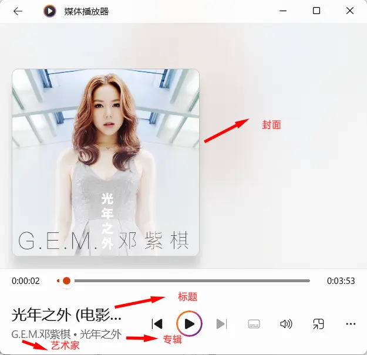
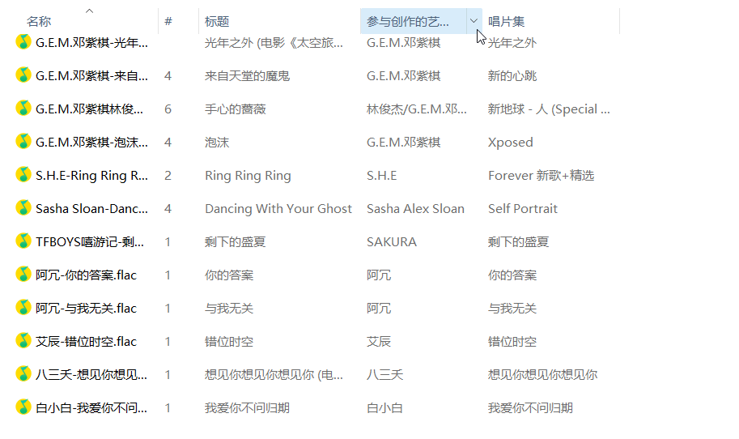
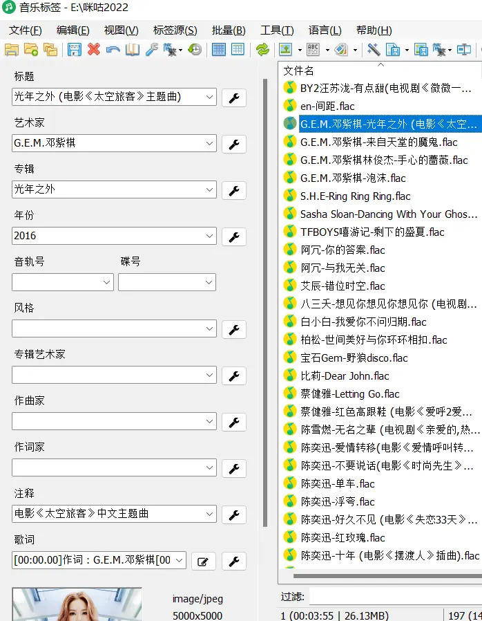
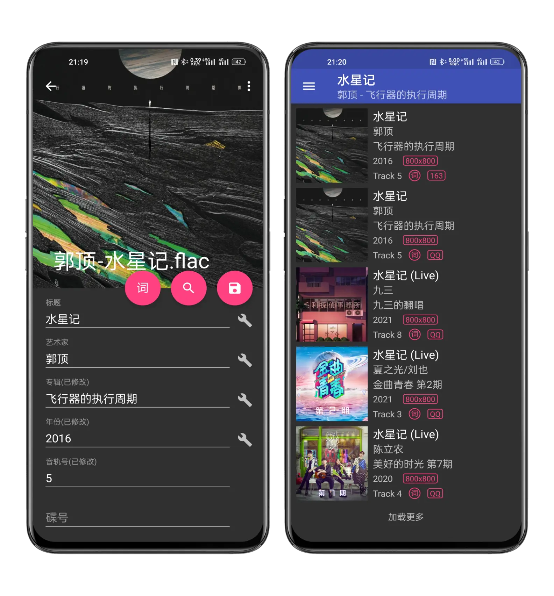
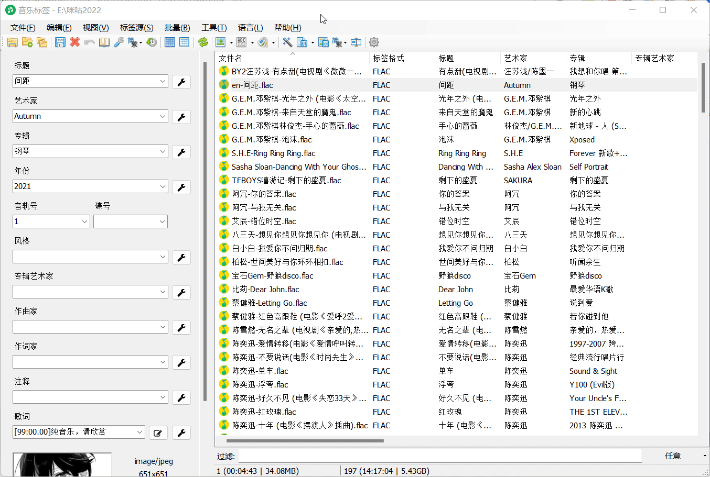
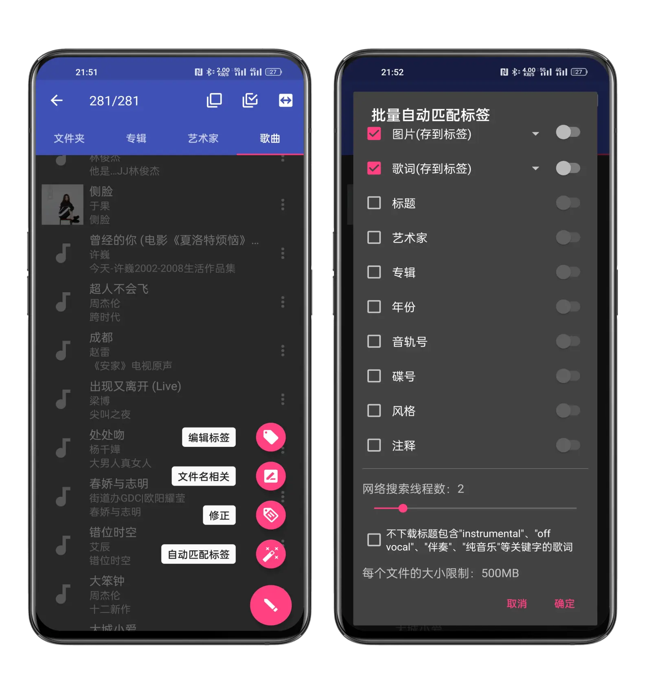
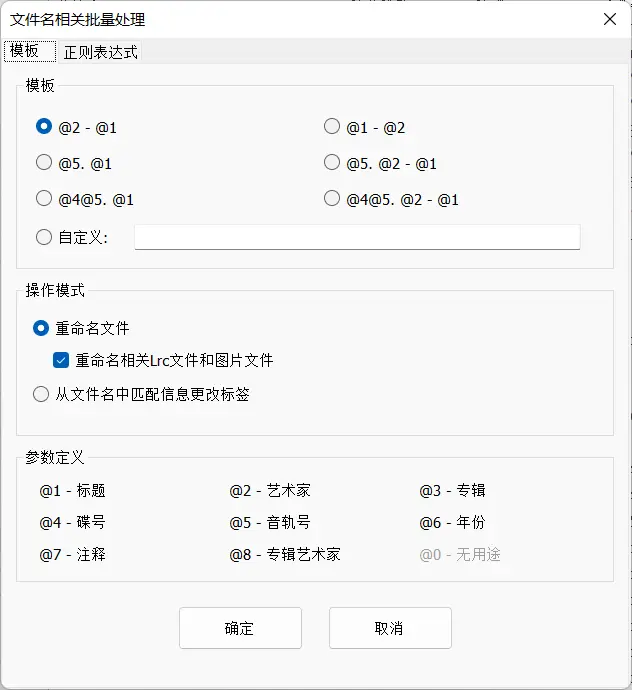
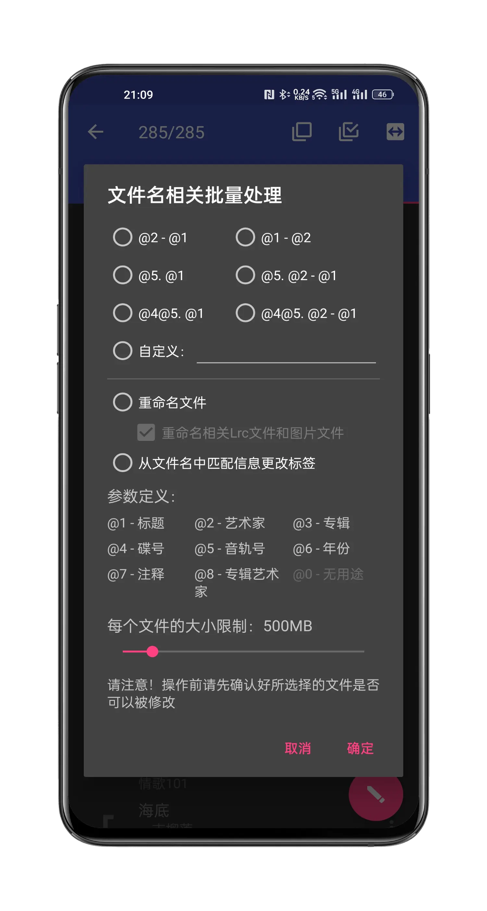

## 播放软件
[千千静听5.0.1](../index.md)

## 修改歌曲软件 
[MusicTag v1.0.9.0](https://pan.baidu.com/s/1NdwvEWXKhVQvKRWmZJfi5A?pwd=dspk){:target="_blank"}

{: width="700"}

下载自不同平台或是网友分享的音乐常常会出现音乐标签信息（音频文件元数据）的缺失：标题、专辑、艺术家、歌词、封面等等。在使用本地音乐播放器时，这些信息的缺失会影响我们的听歌体验。

{: width="700"}

但是音乐标签这款软件可以帮助我们根据已有的信息（如：文件名、已有的标签信息）从第三方平台（如：网易、QQ等）下载获取标题、专辑、艺术家、歌词、封面等各种信息，并且保存到音频文件中。

这样一来，本地播放器、车机、专业HIFI播放器等离线播放器就能通过读取保存在音乐文件中的标签信息，展示封面、歌词、标题、艺术家、专辑等音乐信息，可以根据艺术家、专辑等进行音乐筛选分类。

{: width="700"}

功能展示

单个文件标签修改：`支持手动修改/从标签源获取`

{: width="700"}

{: width="700"}

批量匹配标签信息：

Ctrl+A全选，点击自动匹配标签(魔棒图标)按钮

{: width="700"}

{: width="700"}

文件名与标签信息互转：

支持使用标签信息以自定义格式重命名文件；

文件名显示标题+歌手+专辑 ？或是显示其他信息？命名方式、显示顺序随你改！

支持从文件名匹配信息修改标签。

{: width="700"}

{: width="700"}

还有更多小功能，繁简转换、编码转换、标签历史、封面提取等等！

