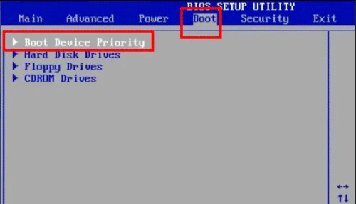

## 系统下载 
Windows^XP^


<!DOCTYPE html>
<html lang="en">

<head>
  <meta charset="UTF-8">
  <meta name="viewport" content="width=device-width, initial-scale=1.0">
  <style>
    table {
      border-collapse: collapse;
      width: 100%;
    }

    td {
      padding: 5px;
    }

    .label {
      text-align: right;
      font-weight: bold;
    }
  </style>
</head>

<body>
  <table>
    <tr>
      <td class="label">文件名：</td>
      <td>zh-hans_windows_xp_professional_with_service_pack_3_x86_cd_x14-80404.iso</td>
    </tr>
    <tr>
      <td class="label">SHA1：</td>
      <td>69DBF131116760932DCF132ADE111D6B45778098</td>
    </tr>
    <tr>
      <td class="label">文件大小：</td>
      <td>601.04MB</td>
    </tr>
    <tr>
      <td class="label">发布时间：</td>
      <td>2008-05-01</td>
    </tr>
  </table>
</body>

</html>  

```
ed2k://|file|zh-hans_windows_xp_professional_with_service_pack_3_x86_cd_x14-80404.iso|630239232|CD0900AFA058ACB6345761969CBCBFF4|/
```


Windows^7^


<!DOCTYPE html>
<html lang="en">

<head>
  <meta charset="UTF-8">
  <meta name="viewport" content="width=device-width, initial-scale=1.0">
  <style>
    table {
      border-collapse: collapse;
      width: 100%;
    }

    td {
      padding: 5px;
    }

    .label {
      text-align: right;
      font-weight: bold;
    }
  </style>
</head>

<body>
  <table>
    <tr>
      <td class="label">文件名：</td>
      <td>cn_windows_7_ultimate_with_sp1_x64_dvd_u_677408.iso</td>
    </tr>
    <tr>
      <td class="label">SHA1：</td>
      <td>2CE0B2DB34D76ED3F697CE148CB7594432405E23</td>
    </tr>
    <tr>
      <td class="label">文件大小：</td>
      <td>3.19GB</td>
    </tr>
    <tr>
      <td class="label">发布时间：</td>
      <td>2011-05-12</td>
    </tr>
  </table>
</body>

</html>  

```
ed2k://|file|cn_windows_7_ultimate_with_sp1_x64_dvd_u_677408.iso|3420557312|B58548681854236C7939003B583A8078|/
```

Windows^10^


<!DOCTYPE html>
<html lang="en">

<head>
  <meta charset="UTF-8">
  <meta name="viewport" content="width=device-width, initial-scale=1.0">
  <style>
    table {
      border-collapse: collapse;
      width: 100%;
    }

    td {
      padding: 5px;
    }

    .label {
      text-align: right;
      font-weight: bold;
    }
  </style>
</head>

<body>
  <table>
    <tr>
      <td class="label">文件名：</td>
      <td>zh-cn_windows_10_consumer_editions_version_22h2_updated_oct_2024_x64_dvd_d0cfb2e9.iso</td>
    </tr>
    <tr>
      <td class="label">SHA1：</td>
      <td>7362475FF1EC340774425F89EC9F924853697BB7</td>
    </tr>
    <tr>
      <td class="label">文件大小：</td>
      <td>6.67GB</td>
    </tr>
    <tr>
      <td class="label">发布时间：</td>
      <td>2024-10-15</td>
    </tr>
  </table>
</body>

</html>  

=== "ed2k"

    ``` ed2k
    ed2k://|file|zh-cn_windows_10_consumer_editions_version_22h2_updated_oct_2024_x64_dvd_d0cfb2e9.iso|7167156224|CFF635F6DCD2011100864BDFD3CAF429|/
    ```

=== "BT种子"

    ``` BT
    magnet:?xt=urn:btih:f5001d461ae74a2833b0cbe6d768b06f436443bc&dn=zh-cn_windows_10_consumer_editions_version_22h2_updated_oct_2024_x64_dvd_d0cfb2e9.iso&xl=7167156224
    ```

Windows^11^


<!DOCTYPE html>
<html lang="en">

<head>
  <meta charset="UTF-8">
  <meta name="viewport" content="width=device-width, initial-scale=1.0">
  <style>
    table {
      border-collapse: collapse;
      width: 100%;
    }

    td {
      padding: 5px;
    }

    .label {
      text-align: right;
      font-weight: bold;
    }
  </style>
</head>

<body>
  <table>
    <tr>
      <td class="label">文件名：</td>
      <td>zh-cn_windows_11_consumer_editions_version_23h2_updated_sep_2024_x64_dvd_edcefbe4.iso</td>
    </tr>
    <tr>
      <td class="label">SHA1：</td>
      <td>E9EA08DA0FCE4EEE537ACAB6949924455E107178</td>
    </tr>
    <tr>
      <td class="label">文件大小：</td>
      <td>6.69GB</td>
    </tr>
    <tr>
      <td class="label">发布时间：</td>
      <td>2024-09-17</td>
    </tr>
  </table>
</body>

</html>  


=== "ed2k"

    ``` ed2k
     ed2k://|file|zh-cn_windows_11_consumer_editions_version_23h2_updated_sep_2024_x64_dvd_edcefbe4.iso|7183915008|C7EDA8C62FA0A8020C100C89D0583D25|/
    ```

=== "BT种子"

    ``` BT
     magnet:?xt=urn:btih:c0dbf0b64fd2f16c9fbca08e123edf75eff5582e&dn=zh-cn_windows_11_consumer_editions_version_23h2_updated_sep_2024_x64_dvd_edcefbe4.iso&xl=7183915008
    ```

## 哈希值对照

用系统自带PowerShell命令

    在你想查看的某个文件路径下，空白处，按着键盘Shift +鼠标右键，就可以在当前路径下(此处)打开PowerShell窗口，打开后直接就是指定到了当下路径。

* `SHA1` - Get-FileHash -Path "路径" -Algorithm SHA1

* `SHA5` - Get-FileHash -Path "路径" -Algorithm MD5

## 跳过联网

电脑不要插入网线，输入++shift++ + ++f10++ ,输入代码 ```oobe\bypassnro``` 回车后系统自动重启

新的跳过联网命令 ```start ms-cxh:localonly```  这个不需要重启

## 安装流程
`制作U 盘`：[微 PE](https://www.wepe.com.cn/){:target="_blank"}

1. 插入U盘：将准备好的U盘插入电脑USB接口。
2. 运行微PE工具箱：双击运行下载好的微PE工具箱安装包。
3. 选择安装到U盘：
     点击“安装PE到U盘”。
     在弹出的界面中，确认选择的U盘无误（注意不要选错磁盘，以免数据丢失）。
     选择安装方案，推荐选择“方案一”，可同时支持UEFI/Legacy启动。
     其他选项可保持默认，点击“立即安装进U盘”。
4. 等待制作完成：微PE会自动格式化U盘并写入启动文件，制作过程通常需要几分钟。完成后，点击“完成安装”。
5. 复制系统镜像：将下载好的系统，GHO镜像文件或者ISO镜像文件复制到制作好的微PE启动U盘中。


`分区工具`：[Diskgenius](https://www.diskgenius.cn/){:target="_blank"} ==在开始安装前，请务必自行备份重要数据。==

   * 引导模式为 Legacy，对应的分区类型为MBR。 (旧电脑引导模式)
   * 引导模式为 UEFI，对应的分区类型为GUID(GPT分区)。 【固态硬盘】
     
    ==对齐分区：勾选“对齐分区到以下扇区数的整数倍”，并选择“4096”，以优化SSD硬盘的性能。==
 
`进入Bios`：开机时按 ++del++ 键 进入BIOS后，点“BOOT”选项，并点击进入“Hard Disk Drives”设置。将“1ST BOOT”选项修改为“USB HDD”，然后按下 ++f10++ 保存更改并重启电脑。这样，在重启时系统将自动从U盘启动。



`CGI还原系统`：适合安装备份的`.gho`或`.wim`文件。


## 主机配置 1
| 配置 1 |                                                | 数量 |
|------|------------------------------------------------|----|
| `CPU` | i5-12400 六核 12线程 Golden Cove                              |    |
| `主板` | 华硕PRIE主板/B660M-K D4                            |    |
| `内存` | 金士顿FC内存/KST 8G 3200                            | 2  |
| `硬盘` | 三星固态硬盘/FM9A1 1TI.2 FCI-E4.0]                   |    |
|  `硬盘`    | 机械 西数 WDC WD10EZEX-08M2NA0 ( 1 TB / 7200 转/分 ) |    |
| `电源` | 先马电源/坦克735盒[额定600w 主动版]                        |    |
| `机箱` | 先马机箱/商英[黑]                                     |    |
| `风扇` | 逾辉机箱风扇/黑框白叶                                    | 1  |


## 主机配置 2
| 配置 2  |                                                | 数量 | 驱动下载                                                                                                                                                 |
|:------|:-----------------------------------------------|:---|------------------------------------------------------------------------------------------------------------------------------------------------------|
| `CPU` | i5-4590 @ 3.30GHz 四核  Haswell                         |    | [核显](https://www.intel.cn/content/www/cn/zh/products/sku/80815/intel-core-i54590-processor-6m-cache-up-to-3-70-ghz/downloads.html){:target="_blank"} |
| `主板`  | 华硕 B85M-G ( Lynx Point )                       |    |                                                                                                                                                      |
| `内存`  | 金士顿 DDR3 1600MHz                               | 1  |                                                                                                                                                      |
| `硬盘`  | 机械 西数 WDC WD10EZEX-08M2NA0 ( 1 TB / 7200 转/分 ) |    |                                                                                                                                                      |
| `显卡`  |          Nvidia GeForce GTX 750 Ti ( 2 GB / 七彩虹 )                                      |    | [官网](https://www.nvidia.cn/geforce/drivers/){:target="_blank"}                                                                                       |
|    `显示器`   |         飞利浦 PHLC0CF PHL 223V5 ( 21.7 英寸  )                                                                               |    |                                                                                                                                                      |
|    `光驱`   |                  索尼-NEC Optiarc DVD-ROM DDU1681S DVD光驱                                                                      |    |                                                                                                                                                      |
|     `声卡`      |                瑞昱 ALC887 @ 英特尔 Lynx Point  高保真音频                                                                                                             |    |                                                                                                                                                      |
|     `声卡`      |                          瑞昱 ALC887 @ 英特尔 Lynx Point HD Audio Controller    0887                                                                                                   |    |                                                                                                                                                      |
|      `网卡`     |                        瑞昱 RTL8168/8111/8112 Gigabit Ethernet Controller / 华硕                                                                                                     |    | [Win7](https://www.asus.com.cn/supportonly/b85m-g/helpdesk_download/){:target="_blank"}                                                                                                                                             |


## 共享提示密码

win7和win10共享出现了需要用户名和密码  ^^[解决办法](https://jingyan.baidu.com/article/48206aead5a952216ad6b3f4.html){:target="_blank"}^^.


