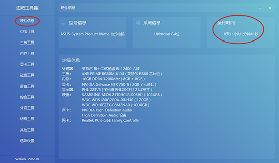
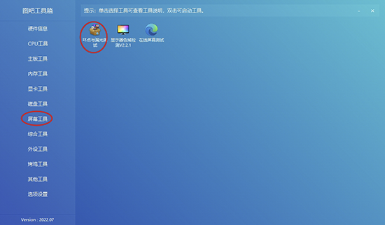
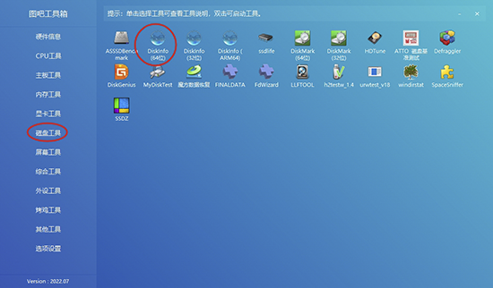
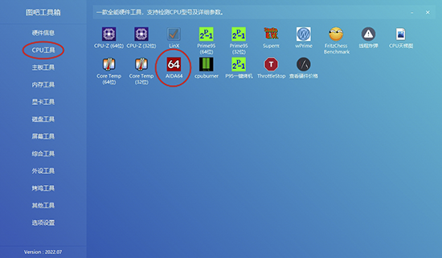
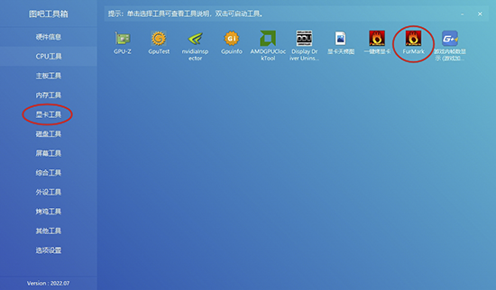

## PotPlayer

* 可用指令安装 

      显示软件信息，不会进行下载和安装操作
```
winget show -s winget potplayer
```
安装命令
```
winget install -s winget PotPlayer
```

* 快捷键配置

      打开一个potplayer窗口，右键->选项->(左下角)导出当前配置->自己找个位置存下来，这软件默认配置文件是.reg注册表格式，想导入直接双击.reg文件执行就行。


## kokoro-project

  * 文字转语音模型  大小仅82M

  * [kokoro-onnx](https://github.com/thewh1teagle/kokoro-onnx){:target="_blank"}


## 图吧工具箱

  * [下载](../index.md)

  * 新机验机必备：图吧工具箱使用指南 （==一定不能联网激活==）跳过联网教程

* #### 检查硬件 

       首先，打开图吧工具箱，检查一下硬件信息，比如CPU、显卡、内存等，看看是否和你购买时的配置一致。



* #### 屏幕检测

      接下来，检查一下屏幕有没有坏点或者漏光。一般超过3个坏点就可以判定是硬件问题，直接退货。

 

* #### 磁盘检测
      
      看看磁盘的通电时间和次数，一般来说，100次以内，50小时以内基本没有问题。

 

* #### CPU单烤 
      
      然后是CPU单烤，看看CPU在满负荷运行时的表现。

 

* #### 显卡单烤 
 
      接着是GPU单烤，也就是显卡单烤，看看显卡在满负荷运行时的表现。

 

* #### 双烤 

      最后是双烤，同时进行CPU和GPU的测试。测试完毕后，把数据和其他博主的进行对比，看看有没有较大差别。
   
!!! warning "特别注意"
    通过这些步骤，你可以确保你的新电脑在硬件上没有任何问题。记住，验机是一个很重要的步骤，不要省略！！！